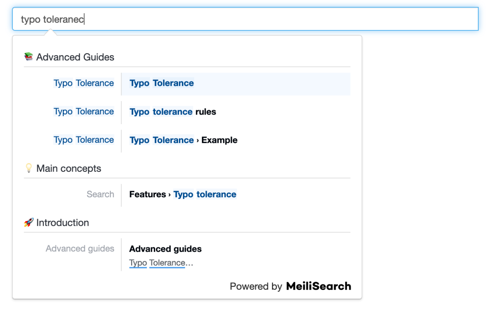

# MeiliSearch Search Bar



If you use Vuepress documentation then there is a fully integrated solution from Meilisearch but outside of that they provide [`docs-searchbar.js`](https://github.com/meilisearch/docs-searchbar.js) repo for any JS based frontend to get a search bar implementation that matches up perfectly with their scraper's configuration.

## Installing

```bash
pnpm install docs-searchbar.js
```

- +++ The Repo Suggests these steps to get it working for any JS framework

  Instantiate the component:

  ```ts
  import docsSearchBar from 'docs-searchbar.js'

  docsSearchBar({
    hostUrl: 'https://mymeilisearch.com',
    apiKey: 'XXX',
    indexUid: 'docs',
    inputSelector: '#search-bar-input',
  })
  ```

  and then add something like this into your HTML:

  ```html
  <!DOCTYPE html>
  <html>
    <head>
      <link
        rel="stylesheet"
        href="https://cdn.jsdelivr.net/npm/docs-searchbar.js@{version}/dist/cdn/docs-searchbar.min.css"
      />
    </head>

    <body>
      <input type="search" id="search-bar-input" />
      <script src="https://cdn.jsdelivr.net/npm/docs-searchbar.js@{version}/dist/cdn/docs-searchbar.min.js"></script>
      <script>
        docsSearchBar({
          hostUrl: 'https://mymeilisearch.com',
          apiKey: 'XXX',
          indexUid: 'docs',
          inputSelector: '#search-bar-input',
          debug: true, // Set debug to true if you want to inspect the dropdown
        })
      </script>
    </body>
  </html>
  ```
- +++ However, to allow for you play with it in this repo we created a simple VueJS wrapper around it
  - in `src/components/SearchBar.vue` you'll find the component