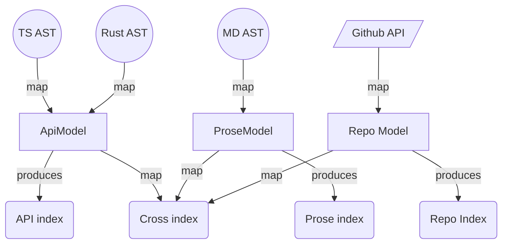

# MeiliSearch Search Bar


## First Considerations

If you use Vuepress documentation then there is a fully integrated solution from Meilisearch but outside of that they provide [`docs-searchbar.js`](https://github.com/meilisearch/docs-searchbar.js) repo for any JS based frontend to get a search bar implementation that matches up perfectly with their scraper's configuration.

Unfortunately this implementation -- as well as the VuePress implementation -- can only work on a _single index_ and it expects the documents to be scraped with MeiliSearch's [scraper]() tool which imposes an awkward looking document (arguably this last point may not matter too much).

>>> MeiliSearch Scraper and Searchbar schema
```ts
export type ScrapeSelector =
  | string
  | {
      selector: string;
      global?: boolean;
      default_value?: string;
    };

export type ScrapeSelectorTargets = {
  lvl0: ScrapeSelector;
  lvl1: ScrapeSelector;
  lvl2: ScrapeSelector;
  lvl3: ScrapeSelector;
  lvl4: ScrapeSelector;
  lvl5: ScrapeSelector;
  lvl6: ScrapeSelector;
  /** the main body of text */
  text: ScrapeSelector;
};
```
> NOTE: there are additional fields but these are the core ones
>>>
>>> To provide flexibility, our parsing/modeling approach supports both

>>>

### Single versus Multi Index Solution

- Having all "content-types" concentrated into a **single index** has the following benefits:
  - the "relevancy score" will fully determine the sort order for recommended search results; this gives a blended set of content-types based on what it thinks is most relevant being at the top
  - Meilisearch's [doc-searchbar.js](https://github.com/meilisearch/docs-searchbar.js) component could be used
- If we had multiple indexes the benefits are:
  - ability to have different index settings per content type (aka, synonmys, relevancy rules, stop words, etc.)
  - we can quite easily _force rank_ content-types (aka., Prose is first, then Repos, then API) if this is desired
    - this _is_ a reasonable strategy with some portfolios of content-types
    - others strategies benefit from a blended cross-index sort and we _could_ do some blending ourselves but this is extra work
  - we can give the property fields more specific names, and add only properties which pertain to the given type.
    -  This helps search maintenance, and custom development of the search toolbar (which is necessary when you have multiple indexes)

## Installing

```bash
pnpm install docs-searchbar.js
```


>>> When using the built-in toolbar:

  Instantiate the component:

  ```ts
  import docsSearchBar from 'docs-searchbar.js'

  docsSearchBar({
    hostUrl: 'https://mymeilisearch.com',
    apiKey: 'XXX',
    indexUid: 'docs',
    inputSelector: '#search-bar-input',
  })
  ```

  and then add something like this into your HTML:

  ```html
  <!DOCTYPE html>
  <html>
    <head>
      <link
        rel="stylesheet"
        href="https://cdn.jsdelivr.net/npm/docs-searchbar.js@{version}/dist/cdn/docs-searchbar.min.css"
      />
    </head>

    <body>
      <input type="search" id="search-bar-input" />
      <script src="https://cdn.jsdelivr.net/npm/docs-searchbar.js@{version}/dist/cdn/docs-searchbar.min.js"></script>
      <script>
        docsSearchBar({
          hostUrl: 'https://mymeilisearch.com',
          apiKey: 'XXX',
          indexUid: 'docs',
          inputSelector: '#search-bar-input',
          debug: true, // Set debug to true if you want to inspect the dropdown
        })
      </script>
    </body>
  </html>
  ```
>>> 

